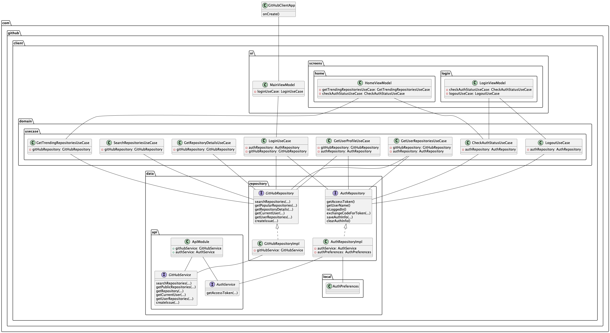

# GithubClient

This is an Android application built using Kotlin and Jetpack Compose to interact with the GitHub
API. It allows users to search for repositories, view repository details, create issues, and manage
their GitHub accounts.

## Architecture

The application follows a Clean Architecture pattern to ensure separation of concerns, testability,
and maintainability. The architecture is structured into several layers:

- **UI Layer:** Contains the Jetpack Compose UI components, responsible for displaying data and
  handling user interactions.
- **Domain Layer:** Contains the business logic and use cases. It defines the core functionalities
  of the application.
- **Data Layer:** Contains the data sources and repositories, responsible for fetching and caching
  data.
- **Framework Layer:** Contains the external frameworks and libraries used in the application, such
  as Retrofit, Koin, and DataStore.

## UML Diagrams

The following UML diagrams provide a visual representation of the application's architecture and
design.

### Application Overview

This diagram illustrates the main components of the application and their interactions.

_Source file: [uml/App.puml](uml/App.puml)_

### Architectural Diagram

This diagram provides a high-level overview of the application's architecture, showing the different
layers and their dependencies.

_Source file: [uml/Architectural.puml](uml/Architectural.puml)_

### Component Diagram

This diagram illustrates the components of the application and their relationships.

_Source file: [uml/Component.puml](uml/Component.puml)_

### Use Case Diagram

This diagram illustrates the use cases supported by the application.

_Source file: [uml/UseCase.puml](uml/UseCase.puml)_

## Features

- Search for GitHub repositories by keyword and language.
- View detailed information about a repository, including its name, description, stars, forks, and
  issues.
- Create issues for a repository.
- Login to GitHub using OAuth.
- View user profile information.
- Browse user repositories.

## Technologies

- Kotlin
- Jetpack Compose
- Retrofit
- Koin
- DataStore
- Mockito
- Cucumber（Not implemented yet）